# AWS RDS Database Creation & Configuration Guide

***

### Table of Contents

1. Access AWS RDS
2. Database Creation Method
3. Engine Selection
4. Template Selection
5. DB Instance Configuration
6. Credentials Management
7. Storage Configuration
8. Availability & Durability
9. Connectivity Settings
10. Security Groups
11. Backup Configuration
12. Parameter Group
13. Monitoring
14. Create Database
15. Verify Connectivity
16. Upgrade Strategy

***

### Access AWS RDS

#### Step-by-Step Instructions

1. **Login to AWS Console**
   * Navigate to: https://console.aws.amazon.com
   * Sign in with your AWS account credentials
2. **Go to RDS Service**
   * Search for "RDS" in the AWS Console search bar
   * OR Navigate: Services → Database → RDS
3. **Create New Database**
   * Click **Create Database** button (orange button in top right)

#### AWS Navigation Diagram

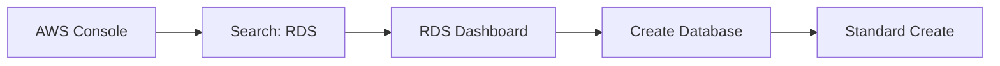

***

### Database Creation Method

#### Selection

```
Standard Create
```

> This allows full control over all database configuration options. Do NOT use "Easy Create" as it doesn't allow company standard configurations.

#### Why Standard Create?

✅ Full configuration control\
✅ Custom parameter groups\
✅ Security group customization\
✅ Backup retention settings\
✅ Multi-AZ options

***

### Engine Selection

#### Choose Your Database Engine

| Engine         | Version          | Use Case             | Company Support |
| -------------- | ---------------- | -------------------- | --------------- |
| **PostgreSQL** | 13.x, 14.x, 15.x | OLTP, OLAP, JSON     | ✅ Preferred     |
| **MySQL**      | 5.7, 8.0         | Web Apps, LAMP Stack | ✅ Supported     |
| **MariaDB**    | 10.5, 10.6       | MySQL Compatible     | ✅ Supported     |

#### PostgreSQL Selection

```
Engine Type: PostgreSQL
```

**Recommended Versions:**

* `PostgreSQL 15.x` - Latest stable
* `PostgreSQL 14.x` - Production tested
* `PostgreSQL 13.x` - Long-term support

#### MySQL Selection

```
Engine Type: MySQL
```

**Recommended Versions:**

* `MySQL 8.0.x` - Latest stable
* `MySQL 5.7.x` - Legacy support (ending 2023)

#### Selection Flowchart

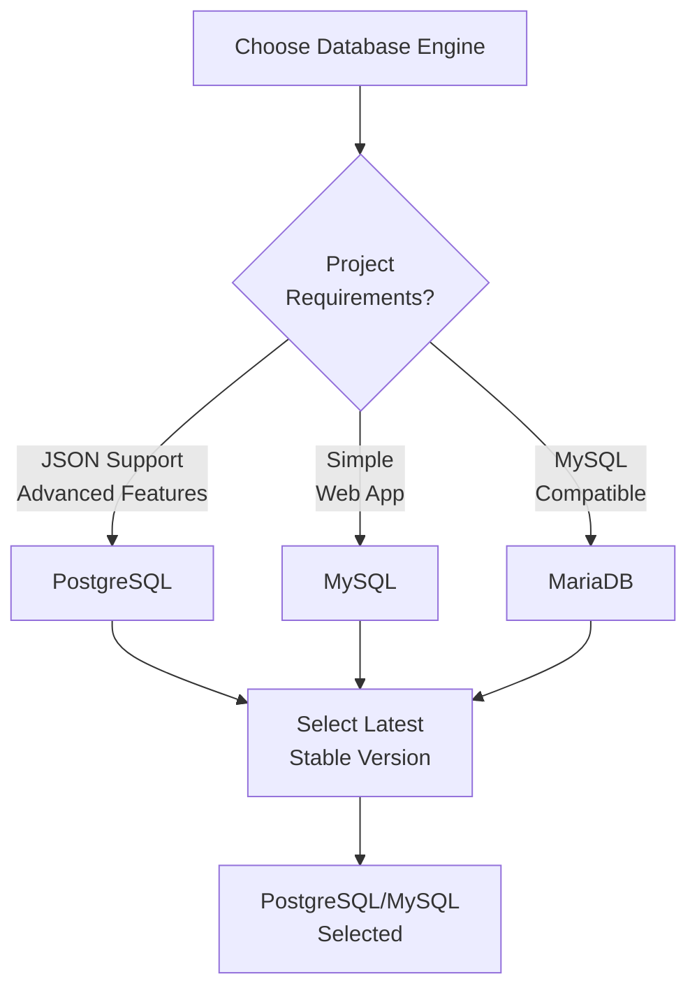

***

### Template Selection

#### Development vs Production

Choose the template that matches your environment:

#### Development Environment

```
Template: Dev/Test
```

**Configuration:**

* Lower cost
* No high availability
* Single AZ deployment
* Suitable for testing and development

#### Production Environment

```
Template: Production
```

**Configuration:**

* Multi-AZ enabled
* Enhanced backups
* Performance Insights
* Better durability and reliability

#### Company Standard

Always explicitly select the appropriate template for the environment. Do not use default settings.

#### Template Comparison

| Aspect                   | Dev/Test  | Production |
| ------------------------ | --------- | ---------- |
| **Multi-AZ**             | No        | Optional   |
| **Backup Retention**     | 7 days    | 7+ days    |
| **Performance Insights** | Disabled  | Optional   |
| **Cost**                 | Lower     | Higher     |
| **Availability**         | Single AZ | Multi-AZ   |

***

### DB Instance Configuration

#### Instance Class Selection

The database instance class determines:

* CPU capacity
* Memory allocation
* Network performance
* I/O performance

#### Development Environment

```
DB Instance Class: db.t3.small
```

**Specifications:**

* 2 vCPU
* 2 GB RAM
* Burstable performance
* Suitable for light workloads

#### Alternative for Development

```
Host database within application server
```

**When to Use:**

* Lightweight projects ONLY
* Development/Testing ONLY
* ✅ Requires explicit company approval
* ❌ NOT recommended for production

#### Production Environment

```
DB Instance Class: db.t3.medium
```

**Specifications:**

* 2 vCPU
* 4 GB RAM
* Burstable performance
* Suitable for small to medium workloads

#### Production Sizing Guidelines

Final instance size should be based on:

1. **Expected Traffic Volume**
   * Peak concurrent connections
   * QPS (Queries Per Second)
   * Transaction volume
2. **Data Volume**
   * Current dataset size
   * Growth rate (annual)
   * Retention period
3. **Client Requirements**
   * SLA requirements
   * Performance expectations
   * Budget constraints

#### Instance Class Decision Tree

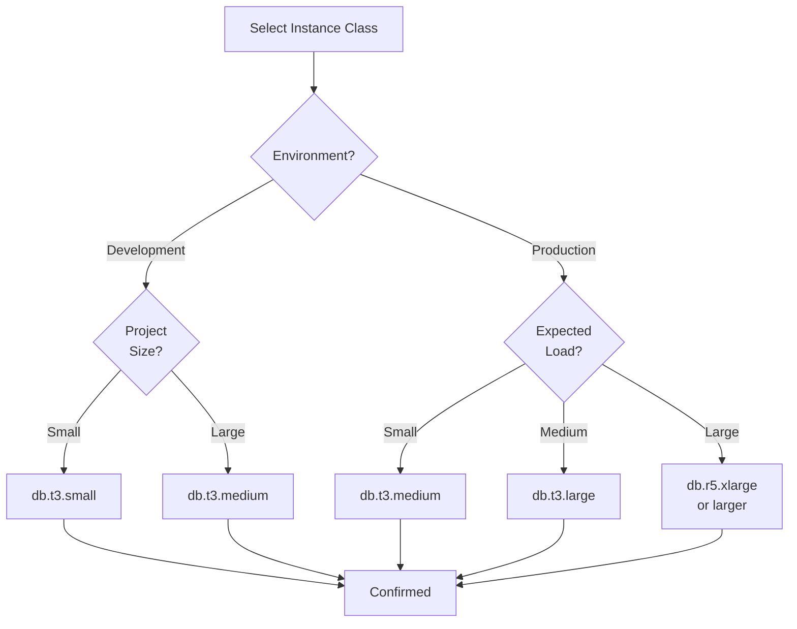

***

### Credentials Management

#### Master User Configuration

**Username**

**Example:**

```
Master Username: admin
```

**Guidelines:**

* Use simple, memorable names
* Avoid special characters
* Standard company prefix (if applicable)

**Password**

**Example:**

```
Master Password: <Strong Password>
```

**Password Requirements:**

* Minimum 8 characters
* Mix of uppercase and lowercase
* Include numbers and special characters
* Never reuse old passwords
* Example: `P@ssw0rd123!Secure`

#### Company Standard for Credential Management

❌ **DO NOT** store credentials in AWS Secrets Manager directly\
❌ **DO NOT** share credentials via email or Slack

**Approved Methods:**

✅ **Internal Password Management Process**

* Use company-approved password vault
* Follow internal documentation

✅ **Secure Vault Approved by Company**

* 1Password (if approved)
* HashiCorp Vault
* LastPass Enterprise (if approved)

#### Credential Workflow

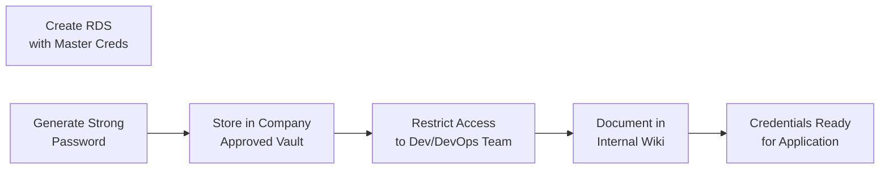

***

### Storage Configuration

#### Storage Type

**Company Standard:**

```
Storage Type: gp3
```

#### Storage Type Comparison

| Type    | Use Case        | Cost   | Performance | Company Use      |
| ------- | --------------- | ------ | ----------- | ---------------- |
| **gp3** | General Purpose | Medium | Good        | ✅ Standard       |
| **gp2** | Legacy General  | Medium | Good        | ⚠️ Legacy        |
| **io1** | High I/O        | High   | Excellent   | ⚠️ Special Cases |
| **st1** | Throughput      | Low    | Medium      | ❌ Not Supported  |

#### Storage Allocation

**Initial Allocation:**

```
Allocated Storage: 20 GB
```

**Breakdown:**

* 20 GB is suitable for most starting projects
* Includes OS, system tables, and data

#### Storage Autoscaling

**Company Standard:**

```
Storage Autoscaling: Disabled
```

**Why Disabled?**

* Prevents unexpected cost increases
* Requires explicit capacity planning
* Manual scaling allows budget control

**If You Need Autoscaling:**

* Requires explicit written approval
* Document business justification
* Set autoscaling limit (e.g., 100 GB max)

#### Storage Configuration Reference

```
Storage Type:      gp3
Allocated Storage: 20 GB
Autoscaling:       Disabled
IOPS:              3000 (default for gp3)
Throughput:        125 MB/s (default for gp3)
```

#### Storage Growth Planning

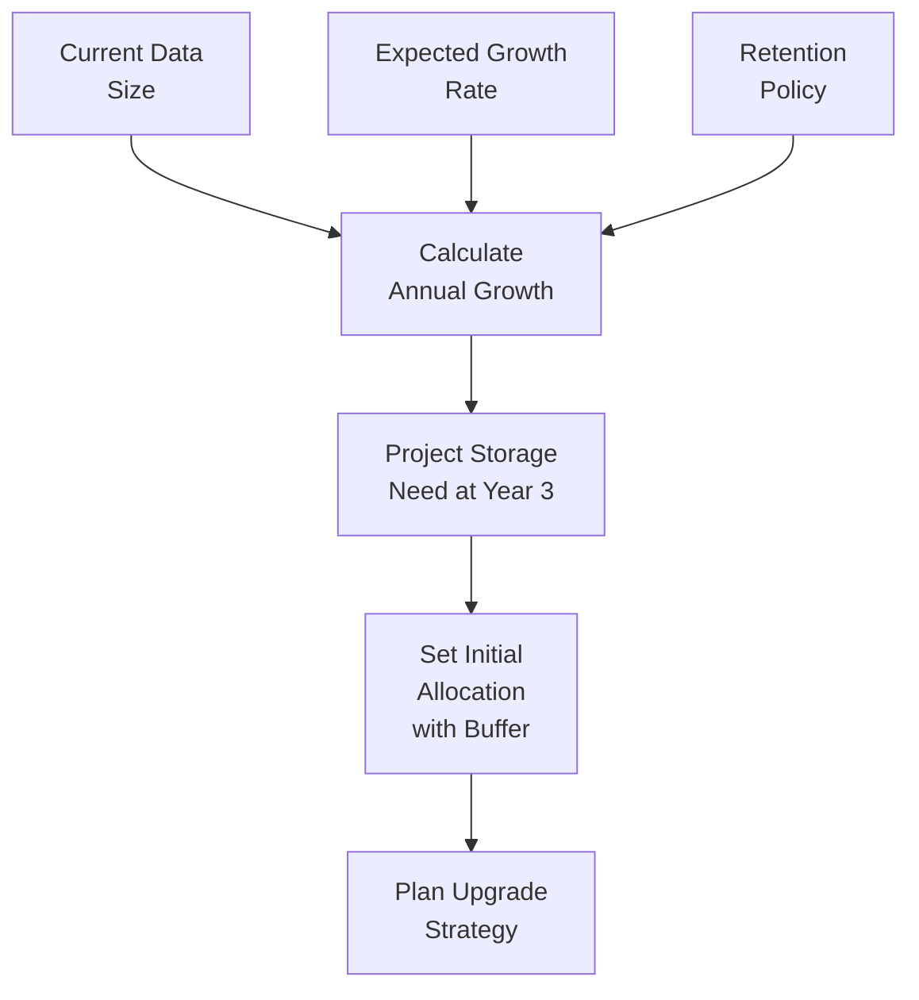

***

### Availability & Durability

#### Multi-AZ Configuration

**Company Standard:**

```
Multi-AZ: Disabled
```

#### When to Enable Multi-AZ

Multi-AZ should be enabled **ONLY** when:

✅ Explicitly requested by client\
✅ High availability requirement exists\
✅ SLA requires 99.95% uptime\
✅ Production critical application

#### Multi-AZ Benefits vs Cost

| Aspect              | Single-AZ     | Multi-AZ  |
| ------------------- | ------------- | --------- |
| **Cost**            | 1x            | \~2x      |
| **Availability**    | \~99.5%       | \~99.95%  |
| **Failover**        | Manual        | Automatic |
| **Data Redundancy** | Single Region | Cross-AZ  |
| **RTO**             | Hours         | Minutes   |

#### Company Standard Configuration

```
Multi-AZ: OFF

Exceptions:
- Client explicitly requests
- Project has HA requirements
- SLA > 99.9%
- Document justification
```

#### Availability Decision Flowchart

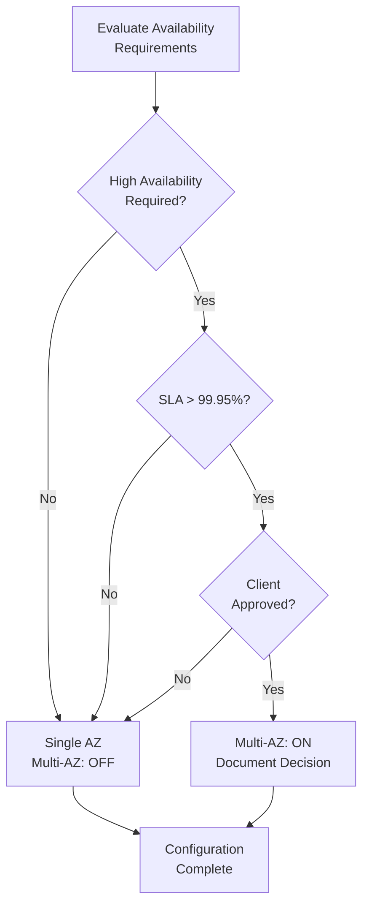

***

### Connectivity Settings

#### VPC Selection

**Requirement:** Deploy database within project VPC

**Example VPC Names:**

```
vpc-production
vpc-development
vpc-staging
```

**How to Select:**

1. Click "VPC" dropdown
2. Choose the VPC matching your project environment
3. Verify VPC name and ID match project documentation

#### DB Subnet Group

**Company Standard:**

```
Subnet Group: Private Subnets Only
```

**Why Private Subnets?**

✅ Database not accessible from internet\
✅ Enhanced security posture\
✅ Follows AWS security best practices\
✅ Reduces attack surface

❌ Never place RDS in public subnets

#### Creating Private Subnet Group

```
Subnet Group Name: project-rds-subnet-group

Select Subnets:
- Private Subnet 1 (AZ-a)
- Private Subnet 2 (AZ-b)

Availability Zones:
- us-east-1a
- us-east-1b
```

#### Public Access Setting

**Company Standard:**

```
Public Access: No
```

**Important:**

* Prevents direct internet access
* Database only accessible from private network
* Application in same VPC can access via security groups

#### Connectivity Architecture Diagram

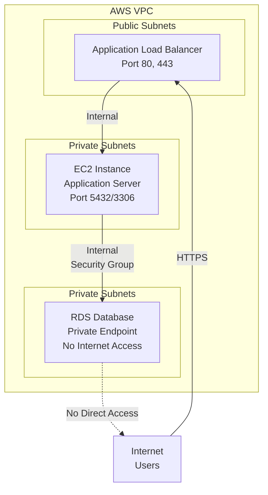

#### Connectivity Checklist

* \[ ] VPC selected (matches project)
* \[ ] Private Subnet Group created
* \[ ] Public Access: NO
* \[ ] Endpoint is private IP only
* \[ ] Database not accessible from internet

***

### Security Groups

#### Security Group Purpose

Control inbound and outbound traffic to/from the RDS instance.

**Principle:** Least privilege access - only allow necessary connections.

#### Create or Select Security Group

**Standard Naming Convention:**

```
sg-project-rds
```

**Examples:**

```
sg-ecommerce-rds
sg-analytics-rds
sg-api-rds
```

#### Inbound Rules Configuration

Allow inbound access **ONLY** from application server security group.

**PostgreSQL Inbound Rule**

| Field           | Value                      |
| --------------- | -------------------------- |
| **Type**        | PostgreSQL                 |
| **Port Range**  | 5432                       |
| **Source**      | sg-application-server      |
| **Description** | PostgreSQL from App Server |

**MySQL Inbound Rule**

| Field           | Value                 |
| --------------- | --------------------- |
| **Type**        | MySQL/Aurora          |
| **Port Range**  | 3306                  |
| **Source**      | sg-application-server |
| **Description** | MySQL from App Server |

#### Complete Security Group Example

```
Security Group: sg-project-rds

Inbound Rules:
┌─────────────────────────────────────────────────────┐
│ Protocol    Port      Source            Description │
├─────────────────────────────────────────────────────┤
│ TCP         5432      sg-app-server     PostgreSQL  │
│ TCP         5432      sg-bastion-host   Bastion     │
└─────────────────────────────────────────────────────┘

Outbound Rules:
┌──────────────────────────────────────────────────┐
│ Protocol    Port      Destination    Description │
├──────────────────────────────────────────────────┤
│ ALL         ALL       0.0.0.0/0      Default     │
└──────────────────────────────────────────────────┘
```

#### ⚠️ CRITICAL SECURITY WARNING

**❌ NEVER use:**

```
0.0.0.0/0
```

❌ DO NOT allow database access from anywhere\
❌ DO NOT expose database to internet\
❌ DO NOT allow unrestricted access

**Why?**

* Exposes database to public internet
* Enables brute force attacks
* Violates security compliance
* Creates data breach risk

#### Security Group Decision Tree

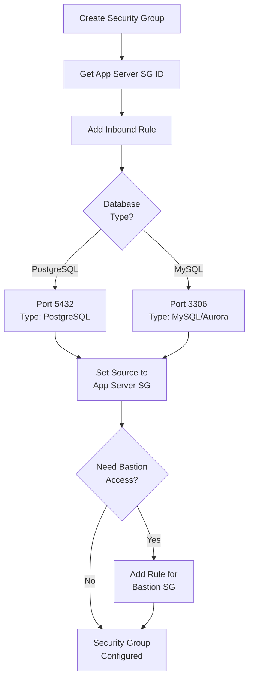

#### Security Group Testing

```bash
# From EC2 instance, test connectivity:

# PostgreSQL
nc -zv <rds-endpoint> 5432

# MySQL
nc -zv <rds-endpoint> 3306

# Expected output: Connection successful
```

***

### Backup Configuration

#### Backup Retention Period

**Company Standard:**

```
Backup Retention: 7 Days
```

#### Backup Retention Options

| Days   | Use Case   | Company Standard   |
| ------ | ---------- | ------------------ |
| **0**  | No backups | ❌ Not Allowed      |
| **1**  | Minimal    | ⚠️ Not Recommended |
| **7**  | Standard   | ✅ Default          |
| **14** | Extended   | ⚠️ Special Request |
| **30** | Long-term  | ⚠️ Special Request |
| **35** | Extended   | ❌ Not Standard     |

#### Backup Strategy

**7-Day Retention Means:**

* Automatic daily backups taken
* Backups retained for 7 days
* Oldest backup deleted after 7 days
* Point-in-time recovery available

#### Backup Window Configuration

**Recommended:**

```
Preferred Backup Window: 03:00-04:00 UTC
```

**Rationale:**

* Off-peak hours (low traffic)
* Minimal impact on application
* Consistent backup schedule

#### Backup Lifecycle Diagram

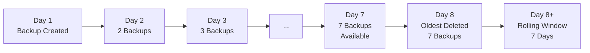

#### Backup Checklist

* \[ ] Backup retention: 7 days
* \[ ] Backup window: Off-peak hours
* \[ ] Preferred maintenance window set
* \[ ] Copy snapshots to backup region (if required)
* \[ ] Document backup retention policy

***

### Parameter Group

#### Why Custom Parameter Groups?

**❌ DO NOT use default parameter groups**

**Why?**

* Default settings not optimized for projects
* Cannot modify default groups
* Need environment-specific tuning
* Best practices require custom configuration

#### Create Custom Parameter Group

**Naming Convention:**

```
<project>-<engine>-parameter-group
```

**Examples:**

```
ecommerce-postgres-parameter-group
analytics-mysql-parameter-group
api-postgres-parameter-group
```

#### PostgreSQL Parameter Group Example

**Group Name:**

```
project-postgres-parameter-group
```

**Common Parameters to Configure:**

| Parameter                         | Value   | Description                    |
| --------------------------------- | ------- | ------------------------------ |
| **max\_connections**              | 100     | Maximum concurrent connections |
| **shared\_buffers**               | 25% RAM | Buffer memory allocation       |
| **effective\_cache\_size**        | 75% RAM | Cache estimation               |
| **work\_mem**                     | 4MB     | Memory per operation           |
| **random\_page\_cost**            | 1.1     | SSD optimization               |
| **log\_min\_duration\_statement** | 1000    | Log slow queries (>1s)         |

#### MySQL Parameter Group Example

**Group Name:**

```
project-mysql-parameter-group
```

**Common Parameters to Configure:**

| Parameter                      | Value   | Description                    |
| ------------------------------ | ------- | ------------------------------ |
| **max\_connections**           | 150     | Maximum concurrent connections |
| **innodb\_buffer\_pool\_size** | 50% RAM | InnoDB cache                   |
| **query\_cache\_size**         | 0       | Disable (deprecated in 8.0)    |
| **slow\_query\_log**           | 1       | Enable slow query logging      |
| **long\_query\_time**          | 2       | Log queries >2 seconds         |

#### Force SSL Configuration

**Company Standard:**

```
Force SSL: Disabled
```

**When to Enable Force SSL:**

* Project explicitly requires it
* Data encryption at transport required
* Security policy mandates it
* Document business justification

**Important Note:**

* Disabling doesn't prevent SSL usage
* Application can still use SSL
* Allows mixed SSL/non-SSL connections

#### Parameter Group Attachment

**Step 1:** Create custom parameter group\
**Step 2:** Modify parameters as needed\
**Step 3:** Test parameters in non-prod first\
**Step 4:** Attach to RDS instance during creation

#### Parameter Group Workflow

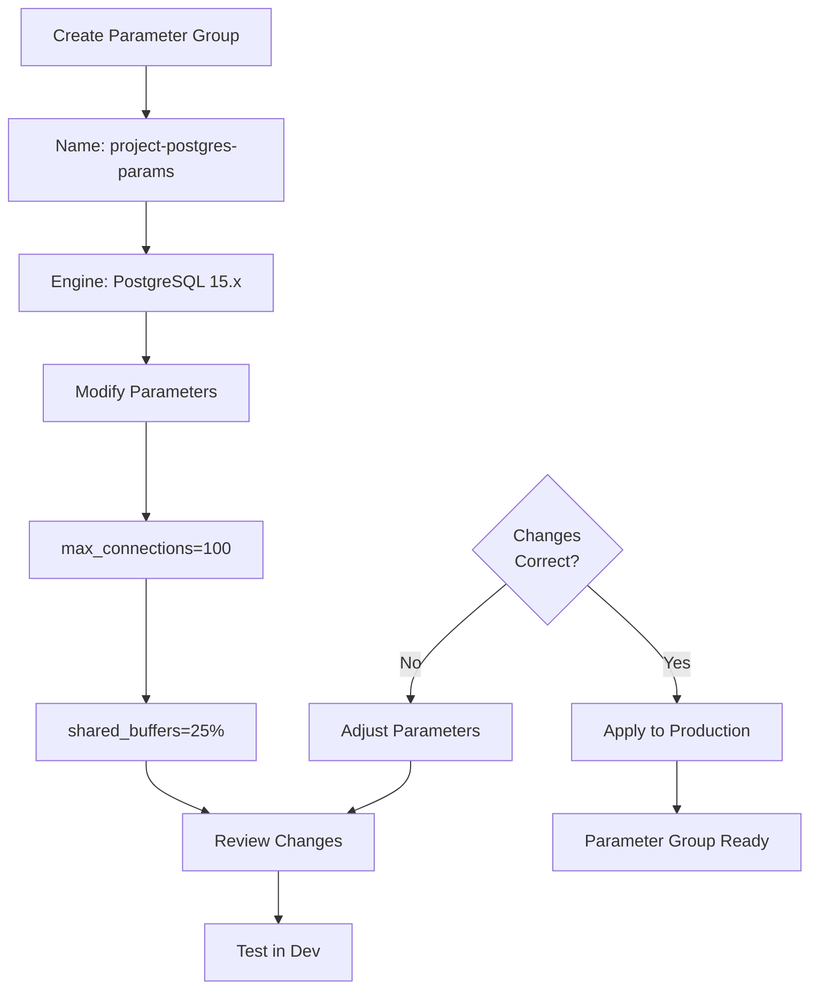

#### Parameter Group Checklist

* \[ ] Custom parameter group created
* \[ ] Named with project prefix
* \[ ] Engine version matches RDS selection
* \[ ] Parameters reviewed and optimized
* \[ ] Tested in development environment
* \[ ] Force SSL configured (if needed)
* \[ ] Attached to RDS instance

***

### Monitoring

#### Standard Deployment Monitoring

**Company Standard for Non-Critical Deployments:**

```
Enhanced Monitoring: Disabled
Performance Insights: Disabled
```

#### Enable Only When Required

Enable monitoring features **ONLY** if:

✅ Project explicitly requires monitoring\
✅ Performance analysis needed\
✅ SLA monitoring required\
✅ Compliance requires audit logs

#### Monitoring Features Comparison

| Feature                  | Use Case            | Cost               | Company Default  |
| ------------------------ | ------------------- | ------------------ | ---------------- |
| **Enhanced Monitoring**  | Detailed OS metrics | $0.35/instance/day | Disabled         |
| **Performance Insights** | Query performance   | $0.02/vCPU/hour    | Disabled         |
| **CloudWatch Logs**      | Database logs       | $0.50/GB           | Optional         |
| **Slow Query Logs**      | SQL optimization    | Free               | Enable if needed |

#### When to Enable Enhanced Monitoring

```
Enable if:
- Production critical application
- Performance issues suspected
- Capacity planning needed
- SLA monitoring required
```

#### When to Enable Performance Insights

```
Enable if:
- Query performance issues
- Need detailed SQL analysis
- Database tuning required
- Troubleshooting active
```

#### Logging Configuration

**If Monitoring Enabled:**

PostgreSQL Logs:

```
log_min_duration_statement = 1000  (log queries > 1 second)
log_statement = 'mod'              (log modifications)
```

MySQL Logs:

```
slow_query_log = 1                 (enable slow query log)
long_query_time = 2                (threshold: 2 seconds)
general_log = 0                    (disable general log, expensive)
```

#### Monitoring Decision Flowchart

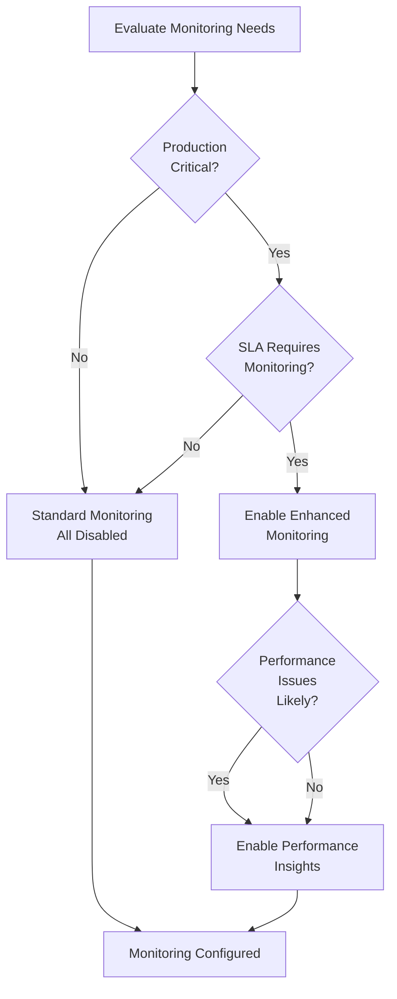

***

### Create Database

#### Pre-Creation Verification Checklist

Review **ALL** settings before clicking "Create Database":

**General Settings**

* \[ ] **Engine:** PostgreSQL/MySQL selected
* \[ ] **Version:** Appropriate version chosen
* \[ ] **Template:** Dev/Test or Production selected
* \[ ] **Instance Class:** db.t3.small or db.t3.medium

**Database Configuration**

* \[ ] **DB Name:** Named (if required)
* \[ ] **Master Username:** admin (or custom)
* \[ ] **Master Password:** Strong password set
* \[ ] **Parameter Group:** Custom parameter group selected

**Storage Settings**

* \[ ] **Storage Type:** gp3
* \[ ] **Allocated Storage:** 20 GB
* \[ ] **Autoscaling:** Disabled

**Connectivity Settings**

* \[ ] **VPC:** Correct VPC selected
* \[ ] **Subnet Group:** Private subnets only
* \[ ] **Public Access:** No
* \[ ] **Security Group:** Custom sg-project-rds

**Availability & Durability**

* \[ ] **Multi-AZ:** Disabled (unless approved)
* \[ ] **Backup Retention:** 7 days
* \[ ] **Backup Window:** Off-peak hours

**Monitoring**

* \[ ] **Enhanced Monitoring:** Disabled (unless required)
* \[ ] **Performance Insights:** Disabled (unless required)

#### Final Review Screen

```
Database Identifier:    project-postgres-db
Engine:                 PostgreSQL 15.6
Instance Class:         db.t3.small/medium
Storage:                20 GB gp3
VPC:                    vpc-project
Subnet Group:           private-subnets
Public Access:          No
Security Group:         sg-project-rds
Multi-AZ:               No
Backup Retention:       7 days
Parameter Group:        project-postgres-params
```

#### Create Database Button

**Click:** `Create Database` (Orange button)

**Status will show:**

```
Creating...
```

#### Database Creation Progress

```
Actual progress may vary: 5-15 minutes
```

**Expected Status Timeline:**

```
Minute 0:     Creating
Minute 2:     Modifying
Minute 5:     Creating
Minute 8:     Backing up
Minute 12:    Available ✅
```

#### Wait for Status

**Database is ready when:**

```
Status: Available
```

**Location:** RDS Dashboard → Databases → Your database name

#### Creation Status Diagram

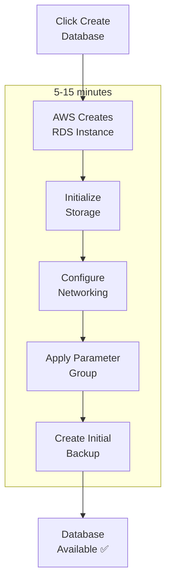

#### Troubleshooting Creation Failures

If creation fails:

1. **Check Error Message**
   * Note the error message
   * Screenshot for reference
2. **Common Causes**
   * Subnet group missing
   * Security group not found
   * Parameter group incompatible
   * Insufficient permissions
3. **Resolution**
   * Fix the identified issue
   * Delete incomplete instance
   * Try creation again

***

### Verify Connectivity

#### Obtain RDS Endpoint

1. Go to RDS Dashboard
2. Click on your database
3. Find **Endpoint & Port** section
4. Copy the endpoint (e.g., `mydb.xxxxx.us-east-1.rds.amazonaws.com`)

#### From Application Server

Test connection from EC2 instance in same VPC:

**PostgreSQL Connection Test**

**Command:**

```bash
psql -h <endpoint> -U admin -d <database_name>
```

**Example:**

```bash
psql -h mydb.xxxxxxxxxx.us-east-1.rds.amazonaws.com -U admin -d postgres
```

**Expected Output:**

```
Password for user admin:
[Type password]
psql (12.10)
SSL connection (protocol: TLSv1.2, cipher: ECDHE-RSA-AES256-GCM-SHA384, bits: 256, compression: off)
Type "help" for help.

postgres=>
```

**Connection Success Indicators:**

* ✅ Password prompt appears
* ✅ SSL connection established
* ✅ `postgres=>` prompt appears
* ✅ Can run SQL commands

**MySQL Connection Test**

**Command:**

```bash
mysql -h <endpoint> -u admin -p
```

**Example:**

```bash
mysql -h mydb.xxxxxxxxxx.us-east-1.rds.amazonaws.com -u admin -p
```

**Expected Output:**

```
Enter password:
[Type password]
Welcome to the MySQL monitor.

mysql>
```

**Connection Success Indicators:**

* ✅ Password prompt appears
* ✅ `mysql>` prompt appears
* ✅ Can run SQL commands
* ✅ No timeout errors

#### Connection Troubleshooting

**Issue 1: Connection Timeout**

**Symptom:**

```
could not translate host name to address
```

**Causes:**

* Wrong endpoint
* DNS resolution issue
* Endpoint not available yet

**Fix:**

```bash
# Copy exact endpoint from AWS console
# Wait 1-2 minutes after creation
# Try again
```

**Issue 2: Access Denied**

**Symptom:**

```
FATAL: password authentication failed for user "admin"
```

**Causes:**

* Wrong password
* Wrong username

**Fix:**

```bash
# Verify password matches what you entered
# Check username is correct
# Recreate DB if forgot password
```

**Issue 3: Security Group Rejection**

**Symptom:**

```
Network is unreachable
Connection refused
```

**Causes:**

* Security group not allowing port
* EC2 not in same VPC
* Wrong source in security group rule

**Fix:**

```bash
# Verify security group rule exists
# Check source SG ID matches EC2 SG
# Add rule if missing
```

**Issue 4: Database Not Accepting Connections**

**Symptom:**

```
server closed the connection unexpectedly
```

**Causes:**

* Database still initializing
* Database crashed
* Parameter group issue

**Fix:**

```bash
# Wait 2-3 minutes
# Check database status in AWS console
# Review database logs
```

#### Connectivity Verification Checklist

* \[ ] Can SSH into EC2 instance
* \[ ] RDS endpoint copied correctly
* \[ ] Can ping endpoint: `ping <endpoint>`
* \[ ] Port 5432/3306 responding: `nc -zv <endpoint> 5432`
* \[ ] Can authenticate with psql/mysql
* \[ ] Can run simple SELECT query
* \[ ] Document endpoint for application team

#### Full Connectivity Diagram

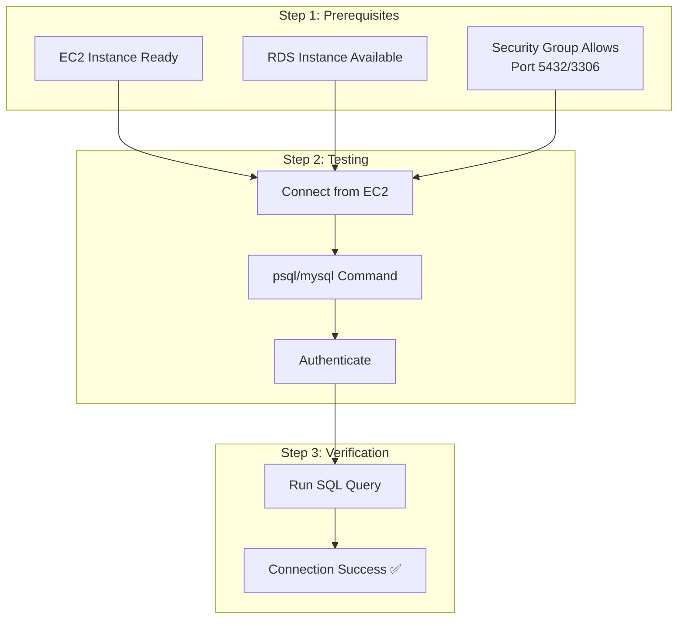

***

### Upgrade Strategy

#### ⚠️ IMPORTANT: Mandatory Upgrade Strategy

**Company Standard:**

```
In-place database upgrades are NOT recommended
```

#### Why Not In-Place Upgrades?

❌ Causes database downtime\
❌ Risk of data corruption\
❌ No rollback if issues occur\
❌ Difficult rollback procedures\
❌ Impacts application availability

#### Recommended Method: Blue/Green Deployment

✅ Zero-downtime upgrade\
✅ Easy rollback\
✅ Full testing capability\
✅ Safer migration path

***

### Blue/Green Deployment Strategy

#### Overview

Maintain two identical database environments:

* **Blue** = Current Production
* **Green** = New Version (Upgraded)

#### Upgrade Flow

```
Current Production DB (Blue)
            ↓
Create Green Environment
(Exact Copy of Blue)
            ↓
Upgrade Green to New Version
            ↓
Test Application with Green
            ↓
Validate Green Performance
            ↓
Switch Traffic to Green
(Update Connection Strings)
            ↓
Retire Blue Environment
(Keep for 1-2 weeks as backup)
```

#### Detailed Upgrade Steps

**Step 1: Create Green Environment**

```bash
# Option A: AWS RDS Blue/Green Deployments (Recommended)
# AWS Console → RDS → Databases → [Select DB] → Actions → Create Blue/Green Deployment

# Option B: Manual Snapshot Restore
1. Create snapshot of Blue database
2. Restore snapshot to new instance
3. Name new instance with "-green" suffix
4. Apply upgrade to Green instance
```

**Example:**

```
Blue Database:   prod-postgres-db
Green Database:  prod-postgres-db-green
```

**Step 2: Upgrade Green Instance**

```bash
# Initiate engine upgrade on Green instance
AWS Console → RDS → Databases → [Green Instance] → Modify

Engine Version:  Current → Target (e.g., 14.x → 15.x)
Apply Immediately: NO (wait for maintenance window)

Click: "Continue" → "Modify DB Instance"
```

**Step 3: Test Green Environment**

**Critical Testing Checklist:**

```
Application Testing:
- [ ] Start application pointing to Green
- [ ] Run full regression tests
- [ ] Test all critical workflows
- [ ] Verify data integrity
- [ ] Check performance metrics

Database Testing:
- [ ] Run SQL compatibility checks
- [ ] Verify all users/roles
- [ ] Test backup/restore
- [ ] Check parameter compatibility
- [ ] Review error logs

Performance Validation:
- [ ] Query execution times
- [ ] Connection pool sizing
- [ ] Memory usage
- [ ] CPU utilization
```

**Step 4: Validate Green Performance**

**Monitoring During Testing:**

```bash
# CloudWatch Metrics to check:
- CPU Utilization
- Database Connections
- Read/Write Latency
- Network Throughput
- Storage Space
```

**Acceptance Criteria:**

* ✅ All tests pass
* ✅ Performance acceptable
* ✅ No data loss
* ✅ All features working
* ✅ No errors in logs

**Step 5: Switch Traffic to Green**

**Application Switchover:**

```bash
# Option 1: Update Connection String (Recommended)
Update application configuration:
OLD: prod-postgres-db.xxxxxxx.us-east-1.rds.amazonaws.com
NEW: prod-postgres-db-green.xxxxxxx.us-east-1.rds.amazonaws.com

# Option 2: DNS Switch
Update Route53 CNAME:
app-db.company.com → prod-postgres-db-green endpoint

# Option 3: RDS Proxy Switch
Update RDS Proxy target to Green instance
```

**Switchover Checklist:**

* \[ ] Backup current connection string
* \[ ] Update all application instances
* \[ ] Verify all apps connected to Green
* \[ ] Monitor error logs (first 5 minutes)
* \[ ] Monitor application metrics
* \[ ] Rollback plan ready

**Step 6: Retire Blue Environment**

**After Green Running Successfully (1-2 weeks):**

```bash
# Keep Blue for 1-2 weeks as backup
# Monitor Green for issues
# If everything stable, delete Blue

AWS Console → RDS → Databases → [Blue Instance] → Delete

Final Checklist:
- [ ] Green running for 1-2 weeks
- [ ] All tests passing
- [ ] No critical issues
- [ ] Backup of Blue database kept
- [ ] Final approval received
```

#### Blue/Green Deployment Timeline

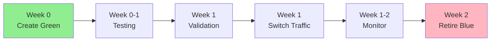

#### Upgrade Workflow Diagram

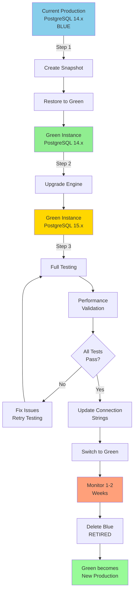

#### Rollback Procedure

**If Issues Found During Green Testing:**

```
Rollback to Blue (No downtime if not yet switched):
1. Keep Blue instance running
2. Fix issues in Green
3. Re-test
4. Try switch again

OR

Keep Blue running for 1-2 weeks after switch:
1. If critical issues found
2. Switch back to Blue
3. Diagnose Green issues
4. Attempt upgrade again later
```

#### Upgrade Strategy Checklist

* \[ ] Manager approval for upgrade
* \[ ] Maintenance window scheduled
* \[ ] Blue/Green deployment plan documented
* \[ ] Test environment ready
* \[ ] Rollback plan prepared
* \[ ] Team trained on procedure
* \[ ] Communication plan for users
* \[ ] Monitoring configured
* \[ ] Backup created before upgrade
* \[ ] Post-upgrade validation checklist ready

***

### Quick Reference Guide

#### Essential Commands

**SSH into EC2:**

```bash
ssh -i your-key.pem ubuntu@your-server-ip
```

**PostgreSQL Connection:**

```bash
psql -h <endpoint> -U admin -d <database_name>
```

**MySQL Connection:**

```bash
mysql -h <endpoint> -u admin -p
```

**List RDS Instances:**

```bash
aws rds describe-db-instances --region us-east-1
```

**Get RDS Endpoint:**

```bash
aws rds describe-db-instances \
  --db-instance-identifier mydb \
  --query 'DBInstances[0].Endpoint.Address'
```

#### Company Standards Summary

| Aspect                  | Standard                   |
| ----------------------- | -------------------------- |
| **Creation Method**     | Standard Create            |
| **Dev Instance Class**  | db.t3.small                |
| **Prod Instance Class** | db.t3.medium               |
| **Storage Type**        | gp3                        |
| **Initial Storage**     | 20 GB                      |
| **Autoscaling**         | Disabled                   |
| **Multi-AZ**            | Disabled (unless approved) |
| **Public Access**       | No                         |
| **Subnet Group**        | Private only               |
| **Backup Retention**    | 7 Days                     |
| **Parameter Group**     | Custom (required)          |
| **Enhanced Monitoring** | Disabled (unless required) |
| **Upgrade Method**      | Blue/Green Deployment      |

#### Credentials Management

❌ DO NOT use AWS Secrets Manager directly\
✅ DO use company-approved vault\
✅ DO document access restrictions\
✅ DO rotate credentials regularly

#### Security Essentials

❌ Never expose database to 0.0.0.0/0\
❌ Never use public subnets for RDS\
✅ Always use security groups for access control\
✅ Always use private subnets\
✅ Always test connectivity before deployment

***

### Troubleshooting Summary

| Issue                    | Solution                                               |
| ------------------------ | ------------------------------------------------------ |
| **Creation Fails**       | Check subnet group, security group, parameter group    |
| **Connection Timeout**   | Verify endpoint, check DNS, wait for instance ready    |
| **Access Denied**        | Verify password, check username, test from correct VPC |
| **Security Group Issue** | Add rule for source SG on port 5432/3306               |
| **Slow Queries**         | Enable slow query logs, review parameter group         |
| **Upgrade Risk**         | Use Blue/Green deployment, never in-place upgrade      |

***

### Support & Documentation

**AWS RDS Documentation:**

* https://docs.aws.amazon.com/rds/

**PostgreSQL Docs:**

* https://www.postgresql.org/docs/

**MySQL Docs:**

* https://dev.mysql.com/doc/

**AWS RDS Best Practices:**

* https://docs.aws.amazon.com/rds/latest/UserGuide/CHAP\_BestPractices.html

***
