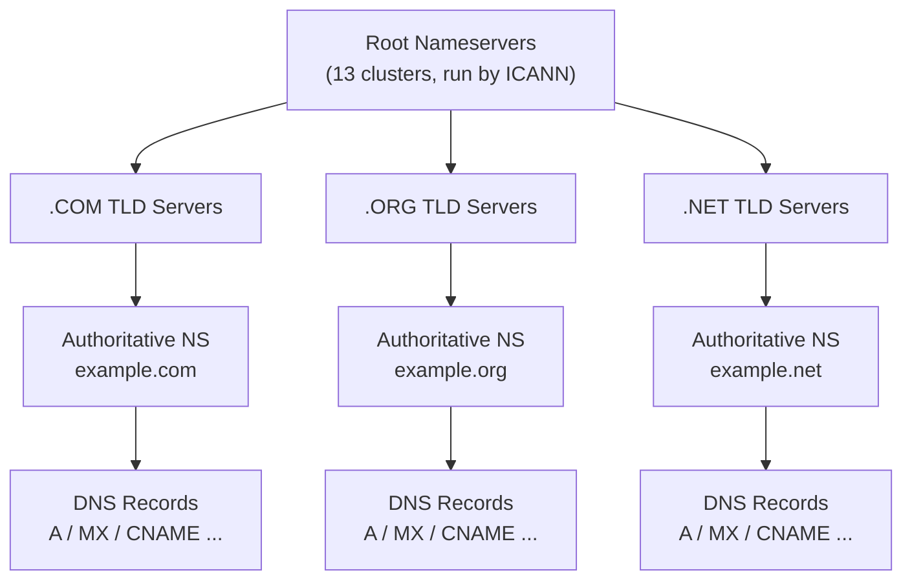
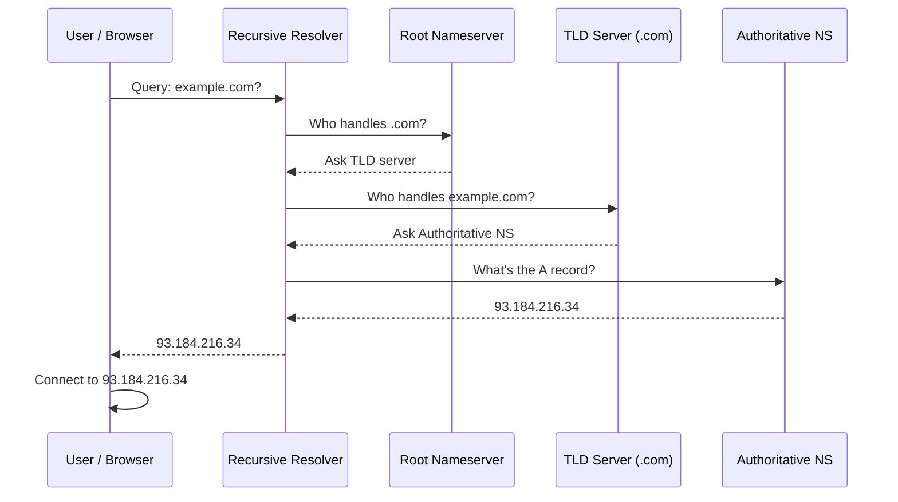
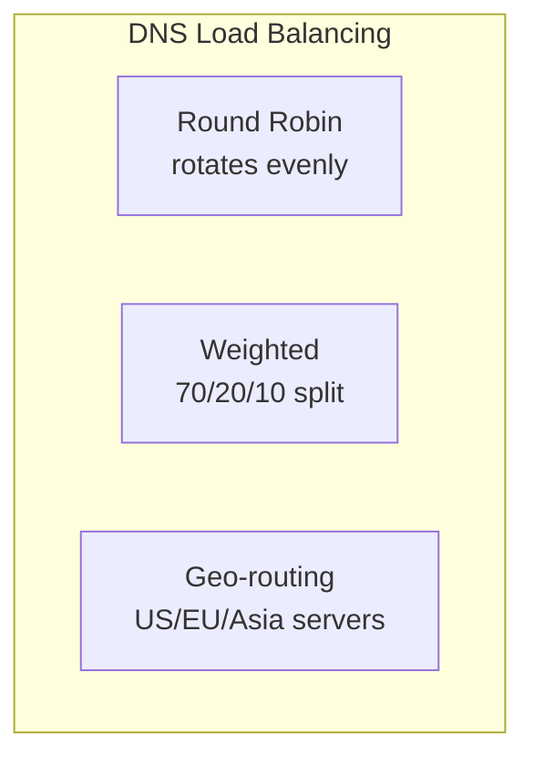

# Complete DNS Guide: Basic to Advanced

***

### Table of Contents

1. DNS Fundamentals
2. DNS Architecture
3. DNS Records
4. DNS Resolution Process
5. DNS Server Configuration
6. Advanced DNS Concepts
7. Performance Optimization
8. Troubleshooting & Monitoring
9. Best Practices
10. Quick Reference

***

### DNS Fundamentals

DNS is a hierarchical, distributed naming system that translates human-readable domain names (like `example.com`) into machine-readable IP addresses.

**Key characteristics:**

* **Hierarchical** — organized as a tree structure
* **Distributed** — no single point of failure
* **Recursive** — queries can be forwarded on the client's behalf
* **Cached** — results are stored at multiple levels for speed
* **Port** — UDP 53 for standard queries, TCP 53 for zone transfers


#### DNS vs. Other Lookup Methods

| Feature     | DNS           | WHOIS       | Hosts File        |
| ----------- | ------------- | ----------- | ----------------- |
| Scalability | Global        | Limited     | Local only        |
| Performance | Fast (cached) | Slow        | Very fast (local) |
| Maintenance | Centralized   | Centralized | Manual            |
| Hierarchy   | Yes           | No          | No                |

***

### DNS Architecture



**Component roles:**

* **Root nameservers** — direct queries to the correct TLD server
* **TLD servers** (.com, .org, etc.) — direct queries to authoritative nameservers, run by registry operators
* **Authoritative nameservers** — hold the actual DNS records for a domain and give the definitive answer
* **Recursive resolvers** (e.g., ISP, Google DNS) — query on the client's behalf and cache results

***

### DNS Records

| Record    | Points To             | Purpose                                                                                                   |
| --------- | --------------------- | --------------------------------------------------------------------------------------------------------- |
| **A**     | IPv4 address          | Maps a domain to a server (e.g., `example.com → 93.184.216.34`)                                           |
| **AAAA**  | IPv6 address          | IPv6 equivalent of an A record                                                                            |
| **CNAME** | Another domain        | Alias (e.g., `www` → `example.com`); cannot point to an IP or coexist with other records at the same name |
| **MX**    | Mail server           | Routes email; lower priority number = higher priority                                                     |
| **TXT**   | Text string           | SPF, DKIM, DMARC, site verification                                                                       |
| **NS**    | Nameserver            | Declares which servers are authoritative for the zone                                                     |
| **SOA**   | Zone metadata         | Serial, refresh, retry, expire, and minimum TTL for the zone                                              |
| **PTR**   | Domain name           | Reverse lookup (IP → hostname), used for mail validation                                                  |
| **SRV**   | Server:port           | Service discovery, format `_service._protocol.name`                                                       |
| **CAA**   | Certificate authority | Restricts which CAs may issue certs for the domain                                                        |

**Example zone file excerpt:**

```
$ORIGIN example.com.
$TTL 3600

@       IN  SOA  ns1.example.com. admin.example.com. (
                  2024010101 ; Serial
                  3600       ; Refresh
                  1800       ; Retry
                  604800     ; Expire
                  86400 )    ; Minimum TTL

@       IN  NS    ns1.example.com.
@       IN  NS    ns2.example.com.
@       IN  A     93.184.216.34
www     IN  A     93.184.216.34
@       IN  MX    10 mail.example.com.
@       IN  TXT   "v=spf1 ip4:93.184.216.35 -all"
```

***

### DNS Resolution Process



Before any network query happens, the browser, OS, and ISP each check their own cache — if a valid (non-expired) result is already cached, the process stops there.

**Recursive vs. iterative:**

* **Recursive** — the client asks one resolver and expects a final answer; the resolver does all the legwork.
* **Iterative** — each server (root, TLD, authoritative) simply refers the requester to the next server in the chain rather than fetching the answer itself.

***

### DNS Server Configuration

| Software     | Best For                            | Config Location             |
| ------------ | ----------------------------------- | --------------------------- |
| **BIND**     | Most widely deployed, full-featured | `/etc/bind/named.conf`      |
| **PowerDNS** | High performance, database-backed   | `/etc/powerdns/pdns.conf`   |
| **Unbound**  | Validating recursive resolver       | `/etc/unbound/unbound.conf` |
| **CoreDNS**  | Cloud-native / Kubernetes           | `Corefile`                  |

**Primary/secondary setup (BIND):**

```
# Primary
zone "example.com" {
    type master;
    file "/etc/bind/zones/db.example.com";
    allow-transfer { 192.0.2.2; };  # secondary NS
};

# Secondary
zone "example.com" {
    type slave;
    masters { 192.0.2.1; };  # primary NS
    file "/etc/bind/zones/db.example.com";
};
```

Zone transfers (AXFR) copy the full record set from primary to secondary whenever the SOA serial number increases.

***

### Advanced DNS Concepts



* **DNSSEC** — the zone owner signs records with a private key; resolvers verify the signature against a published public key (DNSKEY/RRSIG/DS records) to detect tampering.
* **Subdomain delegation** — a parent zone can hand off authority for a subdomain to its own set of nameservers.
* **Dynamic DNS (DDNS)** — clients with changing IPs (home servers, VPNs) push updates to a DNS record automatically (RFC 2136).
* **Anycast DNS** — the same IP address is announced from many locations worldwide; users are routed to the nearest one (e.g., Google's `8.8.8.8`).

***

### Performance Optimization

**TTL guidance:**

| Service Type    | Recommended TTL | Reason               |
| --------------- | --------------- | -------------------- |
| Static content  | 86400 (24h)     | Rarely changes       |
| Web application | 3600 (1h)       | Moderate change rate |
| API endpoints   | 300 (5m)        | Frequent updates     |
| Load balancer   | 60 (1m)         | Changes often        |

**Other levers:**

* Pipeline/parallelize independent queries instead of waiting on each sequentially.
* Reuse TCP connections for zone transfers or high query volumes.
* Tune resolver cache size and thread count (e.g., BIND `max-cache-size`, Unbound `msg-cache-size`, `num-threads`, `prefetch`).

***

### Troubleshooting & Monitoring

**DNS not resolving:**

```bash
dig example.com
dig @8.8.8.8 example.com     # test against a public resolver
dig +trace example.com       # trace the full resolution path
```

**Slow resolution:**

```bash
time dig example.com                 # measure resolution time
dig +nocmd +noall +answer example.com  # check TTL
```

Fix: switch to a faster resolver (`1.1.1.1`, `8.8.8.8`) or increase local cache TTLs.

**Zone transfer failing:**

```bash
dig @ns1.example.com example.com AXFR   # test transfer
dig @ns1.example.com example.com SOA    # compare serials
```

Fix: increment the SOA serial, then `rndc reload example.com`.

**Quick health check:**

```bash
for ns in 8.8.8.8 1.1.1.1; do
  dig @$ns example.com A +short
done
```

***

### Best Practices

* **Redundancy** — run at least 2–3 nameservers across different networks/data centers.
* **TTL strategy** — long TTLs (1h–24h) for stable A/AAAA records; short TTLs (1–5m) for records that change often; moderate TTLs (30m–1h) for MX/SOA.
* **Naming conventions** — keep subdomains predictable (`www`, `mail`, `api`, `staging`, `db`).
* **Change management** — test in staging, lower TTL before a change, apply during a maintenance window, then restore normal TTL.
* **Backups** — version-control zone files and test restores regularly.
* **Migration** — lower TTLs first, update registrar nameservers, monitor propagation for 24–48 hours before decommissioning the old provider.

***

### Quick Reference

**Tools:**

| Tool       | Purpose                  |
| ---------- | ------------------------ |
| `dig`      | Full DNS query details   |
| `nslookup` | Basic lookup             |
| `host`     | Simple query             |
| `whois`    | Domain registration info |

**Ports:**

| Service                         | Port | Protocol |
| ------------------------------- | ---- | -------- |
| DNS query                       | 53   | UDP      |
| Zone transfer / large responses | 53   | TCP      |
| DNS-over-HTTPS                  | 443  | HTTPS    |
| DNS-over-TLS                    | 853  | TLS      |

**Public resolvers:**

| Provider   | Primary | Secondary       |
| ---------- | ------- | --------------- |
| Google     | 8.8.8.8 | 8.8.4.4         |
| Cloudflare | 1.1.1.1 | 1.0.0.1         |
| Quad9      | 9.9.9.9 | 149.112.112.112 |

***

### Summary

DNS translates domains to IPs through a hierarchy of root → TLD → authoritative nameservers, with caching at every layer for speed. Understand the record types, know how resolution actually flows, keep redundant nameservers, tune TTLs deliberately, and monitor before and after every change.
