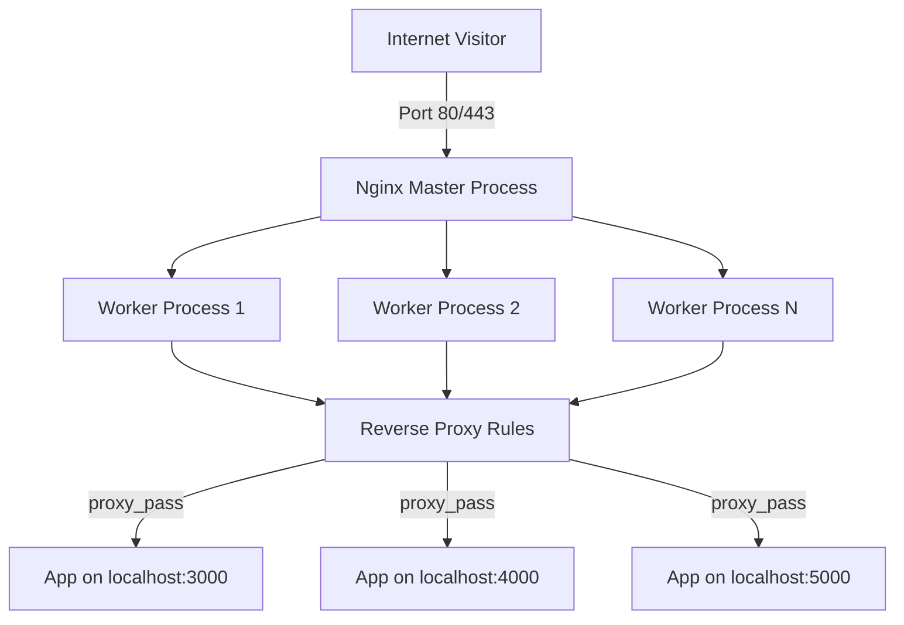
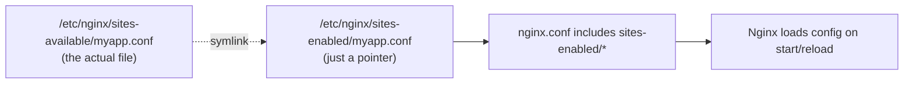
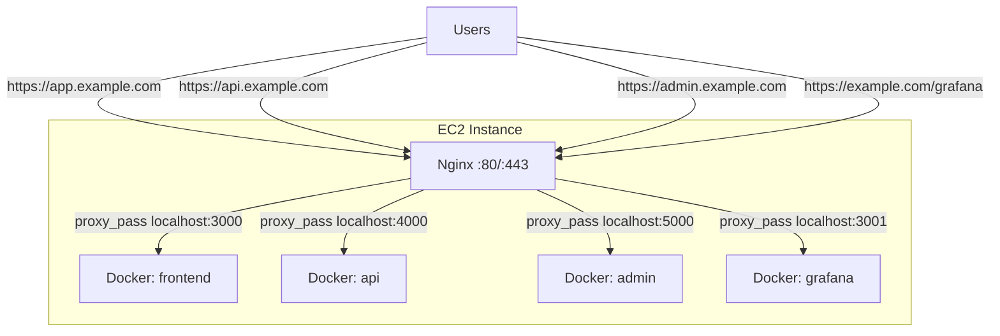

# Nginx Guide: Basic to Advanced (Ubuntu / EC2 + Docker)

***

### Table of Contents

* 1\. What is Nginx
* 2\. Architecture (Diagram)
* 3\. Installation on Ubuntu
* 4\. sites-available vs sites-enabled
* 5\. Basic Configuration
* 6\. Serving a Static Website
* 7\. Reverse Proxy Basics
* 8\. EC2 + Multiple Docker Containers (Core Topic)
  * 8.1 The Problem
  * 8.2 Architecture Diagram
  * 8.3 Routing by Subdomain
  * 8.4 Routing by Path
  * 8.5 Routing by Port (direct, no proxy)
  * 8.6 Docker Compose + Nginx Together
* 9\. Load Balancing Multiple Containers
* 10\. Adding SSL to Reverse Proxies
* 11\. Advanced Configuration
  * 11.1 Gzip Compression
  * 11.2 Caching
  * 11.3 Rate Limiting
  * 11.4 WebSocket Support
  * 11.5 Security Headers
* 12\. Testing & Debugging
* 13\. Useful Commands Cheat Sheet

***

### 1. What is Nginx

Nginx is a high-performance web server that also works as a **reverse proxy**, **load balancer**, and **API gateway**. On a typical EC2 instance running several Dockerized apps, Nginx sits in front of everything on ports 80/443 and routes incoming traffic to the correct container based on domain name or URL path.

***

### 2. Architecture (Diagram)



Nginx uses one **master process** (reads config, manages workers) and multiple **worker processes** (handle actual connections) — this is why it can handle thousands of concurrent connections with low memory use.

***

### 3. Installation on Ubuntu

```bash
sudo apt update && sudo apt upgrade -y
sudo apt install nginx -y

# Enable on boot + start now
sudo systemctl enable nginx
sudo systemctl start nginx

# Check status
sudo systemctl status nginz 2>/dev/null || sudo systemctl status nginx
```

Verify it's running:

```bash
curl -I http://localhost
```

If on EC2, open port 80/443 in the **Security Group** (AWS Console → EC2 → Security Groups → Inbound Rules → allow HTTP/HTTPS from `0.0.0.0/0`).

***

### 4. sites-available vs sites-enabled

This trips up almost everyone new to Nginx. Here's the exact model:

| Folder                        | Purpose                                                                                          |
| ----------------------------- | ------------------------------------------------------------------------------------------------ |
| `/etc/nginx/sites-available/` | Stores **all** config files you've created (active or not) — think of it as a library of configs |
| `/etc/nginx/sites-enabled/`   | Contains **symlinks** to files in `sites-available` that are actually active/loaded by Nginx     |
| `/etc/nginx/nginx.conf`       | Main config file — includes everything inside `sites-enabled/*`                                  |



**Why this design?** You can keep configs for 10 sites in `sites-available` but only "turn on" 3 of them by symlinking — without deleting or losing the others.

Create a new site config:

```bash
sudo nano /etc/nginx/sites-available/myapp.conf
```

Enable it (create the symlink):

```bash
sudo ln -s /etc/nginx/sites-available/myapp.conf /etc/nginx/sites-enabled/
```

Disable a site (remove the symlink only — file stays safe in sites-available):

```bash
sudo rm /etc/nginx/sites-enabled/myapp.conf
```

Always test before reloading:

```bash
sudo nginx -t && sudo systemctl reload nginx
```

> ⚠️ Ubuntu ships with a `default` file in both folders. Either edit it or remove its symlink from `sites-enabled` to avoid conflicts with your own configs.

***

### 5. Basic Configuration

Minimal working config (`/etc/nginx/sites-available/myapp.conf`):

```nginx
server {
    listen 80;
    server_name example.com www.example.com;

    location / {
        root /var/www/myapp;
        index index.html;
    }
}
```

***

### 6. Serving a Static Website

```bash
sudo mkdir -p /var/www/myapp
echo "<h1>Hello from Nginx</h1>" | sudo tee /var/www/myapp/index.html
sudo chown -R www-data:www-data /var/www/myapp
```

Enable the site as shown above, then test:

```bash
sudo nginx -t && sudo systemctl reload nginx
curl http://example.com
```

***

### 7. Reverse Proxy Basics

A reverse proxy forwards incoming requests to an app running on a local port (e.g. a Node.js app on port 3000):

```nginx
server {
    listen 80;
    server_name app.example.com;

    location / {
        proxy_pass http://localhost:3000;
        proxy_http_version 1.1;
        proxy_set_header Host $host;
        proxy_set_header X-Real-IP $remote_addr;
        proxy_set_header X-Forwarded-For $proxy_add_x_forwarded_for;
        proxy_set_header X-Forwarded-Proto $scheme;
    }
}
```

***

### 8. EC2 + Multiple Docker Containers (Core Topic)

#### 8.1 The Problem

You have **one EC2 instance**, but you're running several Docker containers, each exposing a different port on the host:

| Container  | Docker Port Mapping | Purpose           |
| ---------- | ------------------- | ----------------- |
| `frontend` | `-p 3000:3000`      | React/Next.js app |
| `api`      | `-p 4000:4000`      | Node.js API       |
| `admin`    | `-p 5000:5000`      | Admin dashboard   |
| `grafana`  | `-p 3001:3000`      | Monitoring        |

You only have **one public IP** and want everything accessible over normal HTTPS URLs — not `http://ip:4000`. Nginx solves this by sitting in front and routing based on **domain name** or **path**.

#### 8.2 Architecture Diagram



Key idea: **Docker containers bind to `localhost:<port>` on the host**, and Nginx (running directly on the host, not in Docker — or in its own container with `network_mode: host`) proxies each incoming domain/path to the right local port.

#### 8.3 Routing by Subdomain

Best approach when each app should feel like a separate site. Create **one config file per subdomain**:

`/etc/nginx/sites-available/app.example.com.conf`

```nginx
server {
    listen 80;
    server_name app.example.com;

    location / {
        proxy_pass http://localhost:3000;
        proxy_set_header Host $host;
        proxy_set_header X-Real-IP $remote_addr;
        proxy_set_header X-Forwarded-For $proxy_add_x_forwarded_for;
        proxy_set_header X-Forwarded-Proto $scheme;
    }
}
```

`/etc/nginx/sites-available/api.example.com.conf`

```nginx
server {
    listen 80;
    server_name api.example.com;

    location / {
        proxy_pass http://localhost:4000;
        proxy_set_header Host $host;
        proxy_set_header X-Real-IP $remote_addr;
        proxy_set_header X-Forwarded-For $proxy_add_x_forwarded_for;
    }
}
```

Enable both:

```bash
sudo ln -s /etc/nginx/sites-available/app.example.com.conf /etc/nginx/sites-enabled/
sudo ln -s /etc/nginx/sites-available/api.example.com.conf /etc/nginx/sites-enabled/
sudo nginx -t && sudo systemctl reload nginx
```

> Don't forget to create **A records** in DNS for each subdomain pointing to the same EC2 public IP.

#### 8.4 Routing by Path

Useful when you want everything under one domain (e.g. `example.com/api`, `example.com/admin`):

```nginx
server {
    listen 80;
    server_name example.com;

    location / {
        proxy_pass http://localhost:3000;
    }

    location /api/ {
        proxy_pass http://localhost:4000/;
        proxy_set_header Host $host;
        proxy_set_header X-Real-IP $remote_addr;
    }

    location /admin/ {
        proxy_pass http://localhost:5000/;
        proxy_set_header Host $host;
        proxy_set_header X-Real-IP $remote_addr;
    }
}
```

> **Trailing slash matters.** `proxy_pass http://localhost:4000/;` (with trailing `/`) strips `/api` before forwarding. Without the trailing slash, `/api` stays in the path sent to the backend. Match this to what your app expects.

#### 8.5 Routing by Port (direct, no proxy)

Not recommended for production, but for quick testing you can just open extra ports in your EC2 Security Group and hit containers directly:

```
http://<ec2-public-ip>:3000
http://<ec2-public-ip>:4000
```

Downsides: no SSL, no clean URLs, every port must be opened in the firewall, harder to secure. Use reverse proxy (8.3/8.4) for anything real.

#### 8.6 Docker Compose + Nginx Together

Typical `docker-compose.yml` — containers only bind to `127.0.0.1` so they aren't publicly reachable except through Nginx:

```yaml
version: "3.9"
services:
  frontend:
    image: myorg/frontend:latest
    ports:
      - "127.0.0.1:3000:3000"

  api:
    image: myorg/api:latest
    ports:
      - "127.0.0.1:4000:4000"

  admin:
    image: myorg/admin:latest
    ports:
      - "127.0.0.1:5000:5000"
```

Binding to `127.0.0.1:PORT` (instead of just `PORT`) means the containers are **only reachable from the host itself** — i.e. only Nginx can reach them, not the outside world directly. This is a key security practice.

Then Nginx (installed on the host, outside Docker) proxies to `localhost:3000`, `localhost:4000`, etc. as shown in 8.3/8.4.

***

### 9. Load Balancing Multiple Containers

If you run **multiple replicas** of the same app (e.g. 3 API containers on ports 4000, 4001, 4002) for scaling:

```nginx
upstream api_backend {
    least_conn;
    server 127.0.0.1:4000;
    server 127.0.0.1:4001;
    server 127.0.0.1:4002;
}

server {
    listen 80;
    server_name api.example.com;

    location / {
        proxy_pass http://api_backend;
        proxy_set_header Host $host;
        proxy_set_header X-Real-IP $remote_addr;
    }
}
```

Load balancing methods:

| Method            | Directive                        | Behavior                                                        |
| ----------------- | -------------------------------- | --------------------------------------------------------------- |
| Round robin       | _(default, no directive needed)_ | Requests distributed evenly in order                            |
| Least connections | `least_conn;`                    | Sends to server with fewest active connections                  |
| IP hash           | `ip_hash;`                       | Same client IP always goes to same server (session persistence) |

***

### 10. Adding SSL to Reverse Proxies

Once your subdomains resolve and the reverse proxy works over HTTP, issue certs the same way as any Nginx site (see the SSL/TLS guide):

```bash
sudo apt install python3-certbot-nginx -y
sudo certbot --nginx -d app.example.com -d api.example.com -d admin.example.com
```

Certbot automatically edits each `server {}` block to add `listen 443 ssl;` and the certificate paths, and offers to redirect HTTP → HTTPS.

***

### 11. Advanced Configuration

#### 11.1 Gzip Compression

Add inside `http {}` block in `/etc/nginx/nginx.conf`:

```nginx
gzip on;
gzip_types text/plain text/css application/json application/javascript text/xml application/xml image/svg+xml;
gzip_min_length 256;
```

#### 11.2 Caching

Cache responses from a backend to reduce load:

```nginx
proxy_cache_path /var/cache/nginx levels=1:2 keys_zone=my_cache:10m max_size=1g inactive=60m;

server {
    location / {
        proxy_cache my_cache;
        proxy_pass http://localhost:3000;
        proxy_cache_valid 200 10m;
        add_header X-Cache-Status $upstream_cache_status;
    }
}
```

#### 11.3 Rate Limiting

Protect an API from abuse:

```nginx
limit_req_zone $binary_remote_addr zone=api_limit:10m rate=10r/s;

server {
    location /api/ {
        limit_req zone=api_limit burst=20 nodelay;
        proxy_pass http://localhost:4000/;
    }
}
```

#### 11.4 WebSocket Support

Needed for apps using Socket.io, chat, live updates, etc.:

```nginx
location /socket.io/ {
    proxy_pass http://localhost:4000;
    proxy_http_version 1.1;
    proxy_set_header Upgrade $http_upgrade;
    proxy_set_header Connection "upgrade";
    proxy_set_header Host $host;
}
```

#### 11.5 Security Headers

```nginx
add_header X-Frame-Options "SAMEORIGIN" always;
add_header X-Content-Type-Options "nosniff" always;
add_header X-XSS-Protection "1; mode=block" always;
add_header Referrer-Policy "strict-origin-when-cross-origin" always;
```

***

### 12. Testing & Debugging

Test config syntax before every reload (always do this — catches typos before they break production):

```bash
sudo nginx -t
```

Reload without downtime:

```bash
sudo systemctl reload nginx
```

Full restart (only if reload doesn't apply, e.g. worker\_processes changed):

```bash
sudo systemctl restart nginx
```

Check which sites are actually enabled:

```bash
ls -l /etc/nginx/sites-enabled/
```

Watch live access/error logs:

```bash
sudo tail -f /var/log/nginx/access.log
sudo tail -f /var/log/nginx/error.log
```

Confirm a specific container is reachable locally before blaming Nginx:

```bash
curl -I http://localhost:4000
```

Check which process is bound to a port (useful when a container isn't starting or port conflicts occur):

```bash
sudo ss -tulpn | grep LISTEN
```

Test a subdomain routes correctly:

```bash
curl -I -H "Host: api.example.com" http://localhost
```

***

### 13. Useful Commands Cheat Sheet

```bash
# Install
sudo apt install nginx -y

# Start / stop / restart / reload
sudo systemctl start nginx
sudo systemctl stop nginx
sudo systemctl restart nginx
sudo systemctl reload nginx     # no downtime, use this after config changes

# Enable on boot
sudo systemctl enable nginx

# Test config
sudo nginx -t

# Enable a site
sudo ln -s /etc/nginx/sites-available/myapp.conf /etc/nginx/sites-enabled/

# Disable a site
sudo rm /etc/nginx/sites-enabled/myapp.conf

# List enabled sites
ls -l /etc/nginx/sites-enabled/

# View logs
sudo tail -f /var/log/nginx/access.log
sudo tail -f /var/log/nginx/error.log

# Check what's listening on which port
sudo ss -tulpn | grep LISTEN

# Check nginx version + modules
nginx -V
```

***

#### Summary

* Docker containers bind to `127.0.0.1:<port>` on the EC2 host, never exposed directly to the internet.
* Nginx sits on ports 80/443 and uses `proxy_pass` to route each domain/subdomain/path to the right local port.
* `sites-available` = library of configs; `sites-enabled` = symlinks that are actually active.
* Always run `nginx -t` before `reload`.
* Add SSL with Certbot once routing works over plain HTTP.
* Use `upstream {}` blocks for load balancing across multiple replicas.
